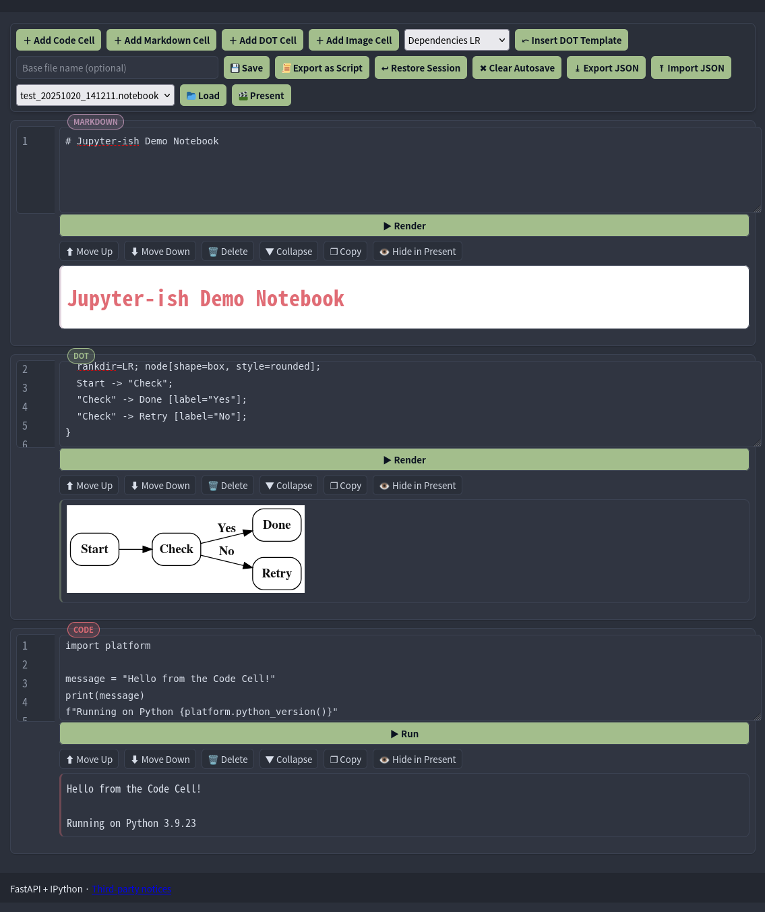
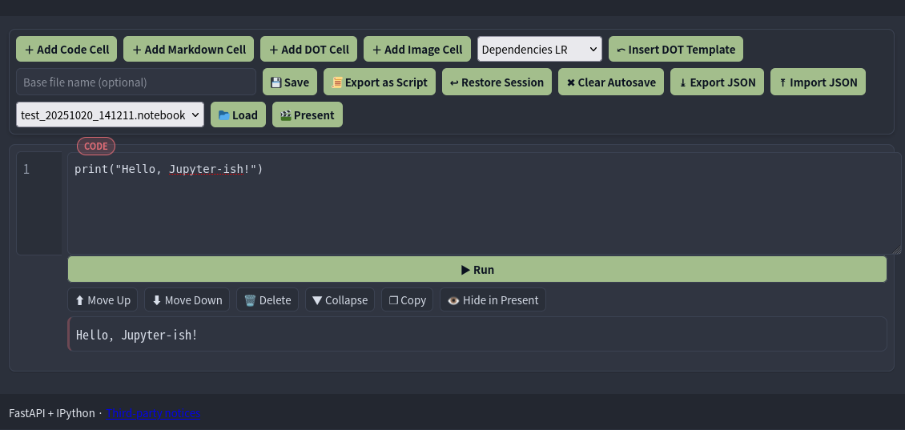
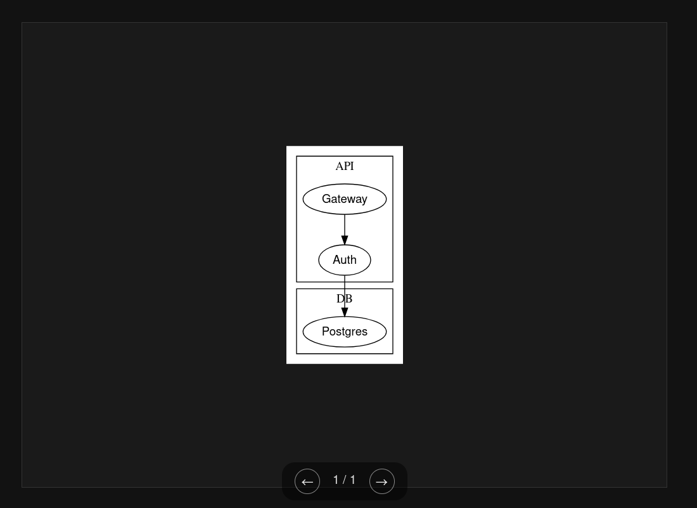

# Jupyter-ish

Jupyter-ish is a lightweight, server-backed web notebook for Python, Markdown, and DOT graph visualization. It's designed for quick prototyping and note-taking in a clean, simple interface.

## Features

Jupyter-ish provides a rich set of features designed for rapid prototyping, analysis, and presentation.

### Versatile Environment
The main interface supports multiple cell types, allowing you to seamlessly mix documentation, diagrams, and executable code in one place.

### Powerful Cell Types
- **Python:** Execute Python code on the server and see the results instantly.
- **Markdown:** Write and render rich text documentation on the fly.
- **DOT:** Describe complex graphs and visualize them immediately.
- **Image:** Display images from a URL or the local filesystem.

### Advanced Cell Controls
Each cell comes with a suite of controls to streamline your workflow, including buttons to fold/unfold content, copy the source to your clipboard, and move cells up or down.

### Presentation Mode
Turn your notebook into a clean, beautiful slideshow with a single click. It's perfect for sharing your findings with the team.

### Robust Workflow Tools
- **Import/Export:** Save and share your notebooks in a portable JSON format.
- **Script Export:** Convert your entire notebook into a standalone Python script.
- **Session Management:** Your work is automatically saved to the browser, so you can pick up right where you left off.

## Getting Started

For installation instructions, please see [INSTALL.md](INSTALL.md).

## License

This project is licensed under the MIT License. See the [LICENSE](LICENSE) file for details.

The licenses for third-party components are located in the `LICENSES` directory.